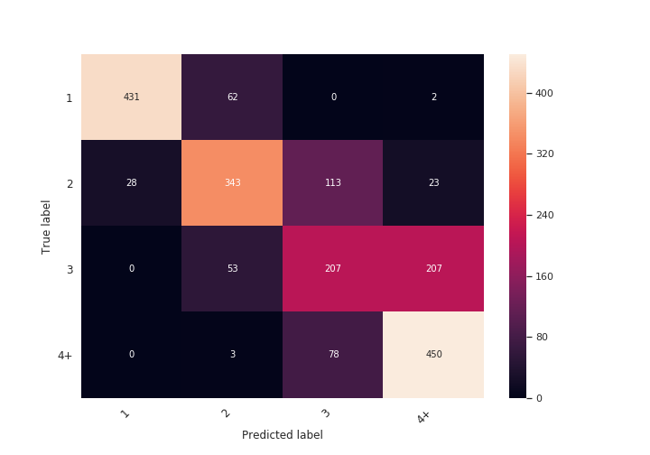

# Speaker Count Estimation using Deep Neural Networks

The main task of this NN is to count speakers on input audio fragment (< 3s)

Classes are [1, 2, 3, 4+] concurrent speakers.

## Data
Data is generated from different speakers of Voxforge dataset. Audios from n speakers is mixed together with preprocessing such as cutting silence and doing other transformation. Code of generating dataset is in DatasetGenerator.py


## Model
I used Audio CRNN model:

```
AudioCRNN(  
  (spec): MelspectrogramStretch(num_mels=128, fft_length=2048, norm=spec_whiten, stretch_param=[0.4, 0.4])
  (net): ModuleDict(
    (convs): Sequential(
      (0): Conv2d(1, 32, kernel_size=(3, 3), stride=(1, 1), padding=[0, 0])
      (1): BatchNorm2d(32, eps=1e-05, momentum=0.1, affine=True, track_running_stats=True)
      (2): ELU(alpha=1.0)
      (3): MaxPool2d(kernel_size=3, stride=3, padding=0, dilation=1, ceil_mode=False)
      (4): Dropout(p=0.1)
      (5): Conv2d(32, 64, kernel_size=(3, 3), stride=(1, 1), padding=[0, 0])
      (6): BatchNorm2d(64, eps=1e-05, momentum=0.1, affine=True, track_running_stats=True)
      (7): ELU(alpha=1.0)
      (8): MaxPool2d(kernel_size=4, stride=4, padding=0, dilation=1, ceil_mode=False)
      (9): Dropout(p=0.1)
      (10): Conv2d(64, 64, kernel_size=(3, 3), stride=(1, 1), padding=[0, 0])
      (11): BatchNorm2d(64, eps=1e-05, momentum=0.1, affine=True, track_running_stats=True)
      (12): ELU(alpha=1.0)
      (13): MaxPool2d(kernel_size=4, stride=4, padding=0, dilation=1, ceil_mode=False)
      (14): Dropout(p=0.1)
    )
    (recur): LSTM(128, 64, num_layers=2)
    (dense): Sequential(
      (0): Dropout(p=0.3)
      (1): BatchNorm1d(64, eps=1e-05, momentum=0.1, affine=True, track_running_stats=True)
      (2): Linear(in_features=64, out_features=4, bias=True)
    )
  )
)
```
## Docker

* Build the docker image: `docker build -t speakerCount .`
* Run container: `docker run -it speakercount:latest  /bin/bash`
* To make prediction on test data run
`python eval.py`
* To inference NN on your data run `python infer.py filepath.wav` 
* To train model on your data run `python train.py`
  
All of my investigation is in CountNet.ipynb Jupyter notebook (code is not prettified)

Total accuracy is about 72 percent.
Confusion matrix:



As expected the most complicated classes are 3 and 4+ speakers. Possible solution is to use another dataset with audio with higer quality.


When building image, docker downloads saved model and input data from my Yandex disk. If the direct link is broken please contact me. Links to my drive:
* [Trained model]( https://yadi.sk/d/azU-uZCUw-Z9Hg )
* [Generated data]( https://yadi.sk/d/2IrjXBWGhwx1IA )

 
## 

## License

MIT